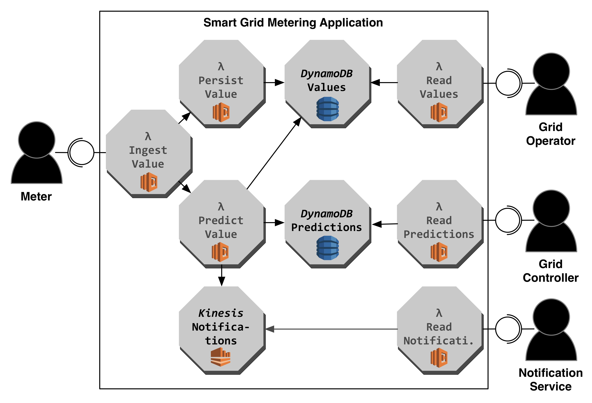

# Smart Meter Monitor Application

### Architecture



### Getting Started

##### Deploy Application
```
sls deploy
```

##### Load Initial Dataset
```
sls invoke -f persistValueFunction -p persistValue/event1.json
sls invoke -f persistValueFunction -p persistValue/event2.json
sls invoke -f persistValueFunction -p persistValue/event3.json
```

##### Emulate Meter Client
```
sls invoke -f ingestValueFunction -p ingestValue/event.json
sls invoke -f ingestValueFunction -p ingestValue/event2.json
sls invoke -f ingestValueFunction -p ingestValue/event3.json
```

##### Emulate Grid Operator Client
```
sls invoke -f readValuesFunction -p readValue/event.json
```

##### Emulate Grid Controller Client
```
sls invoke -f readPredictionsFunction -p readPredictions/event.json
```

##### Emulate Notification Service Client
CURRENTLY NOT SUPPORTED!!!

##### Check Executions
```
sls logs -f ingestValueFunction
sls logs -f persistValueFunction
sls logs -f predictValueFunction
```

##### Remove Deployment
```
sls remove
```